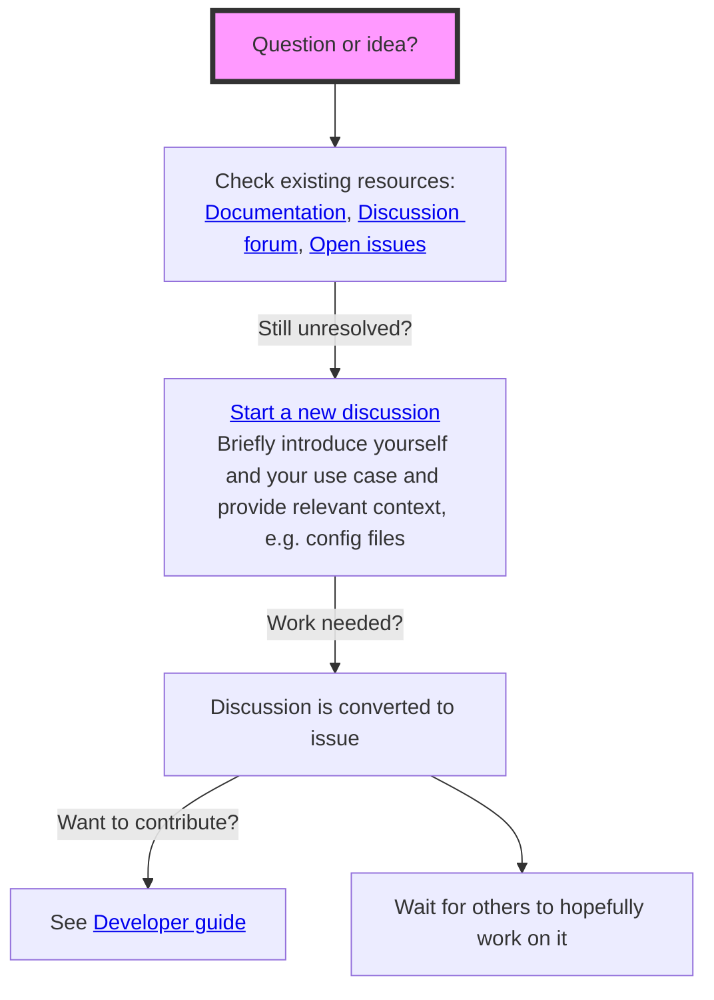

# WAM2layers

[](https://zenodo.org/badge/latestdoi/471007521)
[](https://wam2layers.readthedocs.io/en/latest/?badge=latest)
[](https://pypi.org/project/wam2layers/)

WAM2layers is an atmospheric moisture tracking model. It can be used to determine where
precipitation originally evaporated (backward tracking), or where evaporated moisture
eventually ends up (forward tracking).

Reference paper: [Atmospheric moisture tracking with WAM2layers v3](https://doi.org/10.5194/egusphere-2024-3401)

https://user-images.githubusercontent.com/17080502/233834536-a82ca96d-e303-4592-a588-472097ebe6c5.mp4

The animation above illustrates the concept of backward tracking: you first see the water
content and fluxes in the tracking domain move forward in time (left panel). 
Midway through, the animation reverses and the moisture from the "tagging region" 
is tracked backward in time (right panel).

## How does it work

The simplest experiment with WAM2layers could look like this

```sh
pip install wam2layers[viz]
wam2layers download example-input-eiffel
cd example-input-eiffel
wam2layers preprocess era5 config-eiffel.yaml
wam2layers track config-eiffel.yaml
wam2layers visualize output config-eiffel.yaml
```

See the [documentation](https://wam2layers.readthedocs.io/en/latest/) for a more detailed description. We also have a [video walkthrough](https://youtu.be/QudlILlZnOg)!

## Finding help



# Other versions

This is the official codebase for the WAM-2layers moisture tracking model as of
18/03/2022, but there are still several other (older) versions around:

- [Original Python code for ERA-Interim by Ruud van der Ent](https://github.com/ruudvdent/WAM2layersPython)
- [Adapted version for EC-Earth by Imme Benedict](https://github.com/Imme1992/moisture_tracking_mississippi)
- [Adapted version for MERRA2 by Pat Keys](https://github.com/pkeys/WAM2layersPythonMerra2)
- [Adapted version for ERA5 pressure levels by Mingzhong Xiao](https://zenodo.org/record/4796962#.Y25d1-TMIVA)
- [Adapted version for ERA5 by Theo Carr](https://github.com/ktcarr/WAM2layers_ERA5)

# Reuse and acknowledgement

This code is currently developed by a core team:
Ruud van der Ent (Delft University of Technology)
Imme Benedict (Wageningen University)
Chris Weijenborg (Wageningen University)
Peter Kalverla (Netherlands eScienceCenter)
Bart Schilperoort (Netherlands eScience Center)

We are proudly part of [open-sustainable-technology](https://github.com/protontypes/open-sustainable-technology).

If you use the code for a publication, please cite it using the [DOI of the
appropriate release](https://doi.org/10.5281/zenodo.7010594) and the
following paper (currently in preprint):
[Atmospheric moisture tracking with WAM2layers v3](https://doi.org/10.5194/egusphere-2024-3401)

<p align='right'>


</p>
