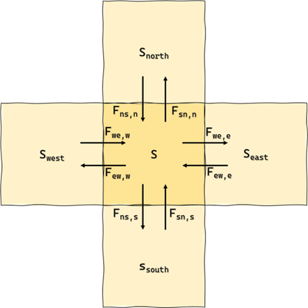

# Theory

The equations implemented in WAM2layers v3 are described in detail in 
[this manuscript](https://doi.org/10.5194/egusphere-2024-3401). Below, we 
provide a brief summary of the main principle.

Considering the schematic illustration below, forward- and backward tracking can
be formulated respectively as:

```{math}
\begin{align}
s_{t+1}=s_t & + F_{we,w}\ast s_{t,w} - F_{we,e}\ast s_t + F_{ew,e}\ast s_{t,e} - F_{ew,w}\ast s_t \\
            & + F_{ns,n}\ast s_{t,n} - F_{ns,s}\ast s_t + F_{sn,s}\ast s_{t,s} - F_{sn,n}\ast s_t \\
            & + F_{ul,u}\ast s_{t,u} - F_{ul,l}\ast s_t + F_{lu,l}\ast s_{t,l} - F_{lu,u}\ast s_t \\
            & + E - P
\end{align}
```

```{math}
\begin{align}
s_{t-1}=s_t & + F_{we,e}\ast s_{t,e} - F_{we,w}\ast s_t + F_{ew,w}\ast s_{t,w} - F_{ew,e}\ast s_t \\
            & + F_{ns,s}\ast s_{t,s} - F_{ns,n}\ast s_t + F_{sn,n}\ast s_{t,n} - F_{sn,s}\ast s_t \\
            & + F_{ul,l}\ast s_{t,l} - F_{ul,u}\ast s_t + F_{lu,u}\ast s_{t,u} - F_{lu,l}\ast s_t \\
            & - E + P
\end{align}
```

where $F$ are (total) moisture fluxes and $s$ represents the amount
of tracked relative to total moisture in the grid cells. The vertical fluxes,
denoted by underscript $u$ and $l$, are not illustrated, but they
follow the same systematic as the horizontal fluxes. Note that all fluxes are by
definition positive; this is needed because moisture flux is scaled with the
relative amount of tracked moisture in the grid cells where it originates from.



In WAM2Layers code, these equations are solved for one upper and one lower layer
(such that only two of the 4 vertical transport terms are relevant for each
layer). The evaporation term is used for the lower layer only, while the
precipitation contribution is distributed across the two layers.

## Sensitivity analysis time and vertical resolution
In WAM2layers (and in most other moisture tracking mdodels) several settings are
optional regarding resolutions in time and space. It is fair to say that 
systematic testing of these options has received little attention in literature.
We, therefore, recommend to at least critically think about these settings
in the light of your research question rather than just applying the default 
values from the config file. A recommended sensitivity study is [this
thesis](http://resolver.tudelft.nl/uuid:b6b356f1-d182-4877-b228-32541574a159),
for which the underlying data can be found 
[here](https://doi.org/10.4121/8491b1ea-9964-4db6-9c64-93382945eb24)