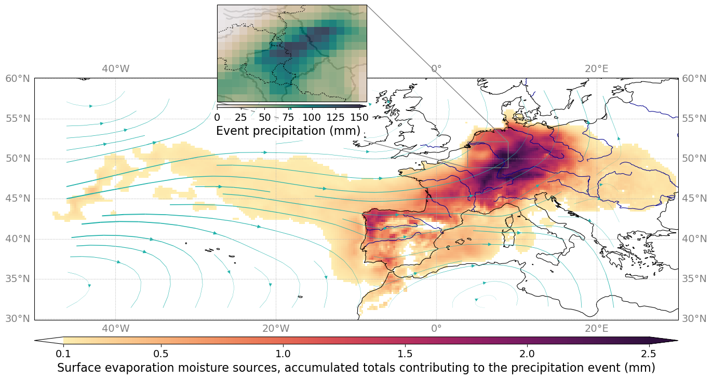
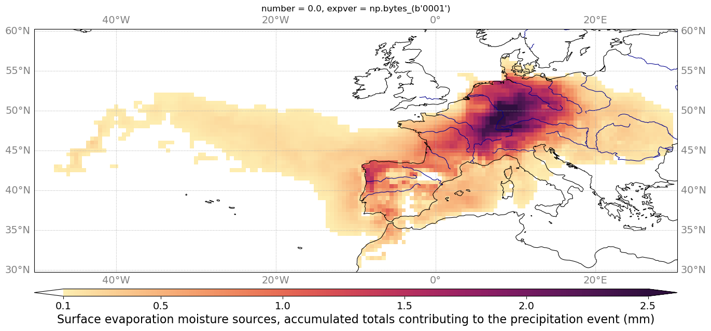
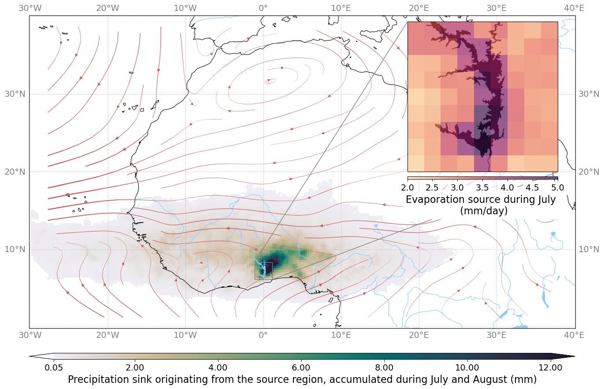
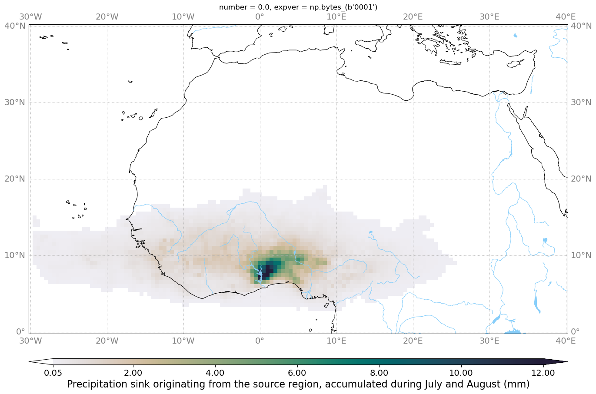

(opendap)=

# Using Remote Preprocessed Data

83 years of preprocessed ERA5 data are available via the 4TU ResearchData
repository ([Bakels et al.
(2025)](https://doi.org/10.4121/00f7fa45-899e-4573-ae23-234f6c5193d0.v1)). This
dataset:

* covers the period **1941–2024**
* is regridded to a resolution of **0.5° × 0.5°**
* uses the 'standard' model level configurations with 22 model levels

WAM2layers provides two ways to download this data specifically for your experiment:

* ["Two-step approach"](#two-step-approach): download all required pre-processed data as specified in your config file then track it.
* ["On the fly"](#on-the-fly-configuration): ingest data during the tracking routine using OPeNDAP.

## Two-step approach

With this approach WAM2layers reads your config file, detects the start and end dates and the tracking domain, and downloads the corresponding data.

To download input data, prepare your configuration file as usual, and run:

```bash
wam2layers download-from-config <your-config.yaml>
wam2layers track <your-config.yaml>
```

Data will be downloaded to the `preprocessed_data_folder` in your config file. By default cropping is applied using `tracking_domain`. If you want to retain the full domain of the data, you can use the `--no-crop` option to skip the cropping step.

```bash
wam2layers download-from-config --no-crop <your-config.yaml>
```

We implemented two protocols, `http` and `dap4`. HTTP is the most stable protocol, but unlike DAP4, it does not allow subsetting data on the server side. This means data will first be downloaded to your machine, and then the tracking domain is cropped. DAP4 allows server-side subsetting, so you will have reduced data transfers. However, DAP4 is unstable (producing garbage data), and we have disabled it until further notice.

If you want to retain the full domain of the data, you can use the `--no-crop` option to skip the cropping step.

Advantages of the two-step approach:

- Repeated experiments: after the initial download time, running the tracking experiment is faster (about 5 times in our test case).
- Data analysis: during interpretation it can be useful to also look at the input data. Some of the built-in visualisation routines also rely on input data.
- Stability: downloading data in advance can be more stable than doing it on the fly, and reduces the risk of having to re-run an experiment that crashed midway.


## On-the-fly configuration

Instead of downloading the data beforehand, OPeNDAP also supports reading data on the fly. This eliminates the storage of intermediate files, but can be slower and potentially unstable.

To use this feature, you will need to create a modified config file that points to the OPeNDAP server. Example configuration files that work with OPeNDAP can be found [here](https://github.com/WAM2layers/WAM2layers/tree/main/configs).

Notice that the `preprocessed_data_folder` points to a **remote URL** instead of a local directory:

```yaml
# General settings
preprocessed_data_folder: https://opendap.4tu.nl/thredds/dodsC/data2/djht/00f7fa45-899e-4573-ae23-234f6c5193d0/1
```

These examples mimic the examples mentioned under [Example
data](https://wam2layers.readthedocs.io/en/latest/userguide/input.html#example-data),
but with lower resolution and thus based on already preprocessed data. You run them as any other configuration file.

```bash
wam2layers track opendap-config-eiffel.yaml
wam2layers track opendap-config-volta.yaml
```

```{Admonition} Performance is unstable
:class: warning

Despite our rigourous testing, it appears that the OPeNDAP data access can be unstable (https://github.com/WAM2layers/WAM2layers/discussions/504).

If you're facing difficulties with reading the OPeNDAP data on the fly, we recommend trying the two-step approach instead.

```

## Citation

If you use this dataset, please cite it as:

**Bakels, Lucie, van der Ent, R. J. (Ruud), Wang-Erlandsson, Lan, & Kalverla, Peter. (2025). *WAM2layers preprocessed data from 01-01-1941 until 31-10-2014*. 4TU.ResearchData. [https://doi.org/10.4121/00f7fa45-899e-4573-ae23-234f6c5193d0.v1](https://doi.org/10.4121/00f7fa45-899e-4573-ae23-234f6c5193d0.v1) (CC BY 4.0)**

## 0.25° vs. 0.5° data
Differences between the **0.5° × 0.5°** and **0.25° × 0.25°** data were found to lead only to small differences for the example cases.
Note, that the differences can be caused by an interplay between differences in ERA5 data, resolution and internal time step of the tracking as well as slightly different tagging regions as original 0.25° mask could not perfectly be mimicked with the 0.5° data.


0.25° backward Eiffel case


0.5° backward Eiffel case


0.25° forward Volta case


0.5° forward Volta case
